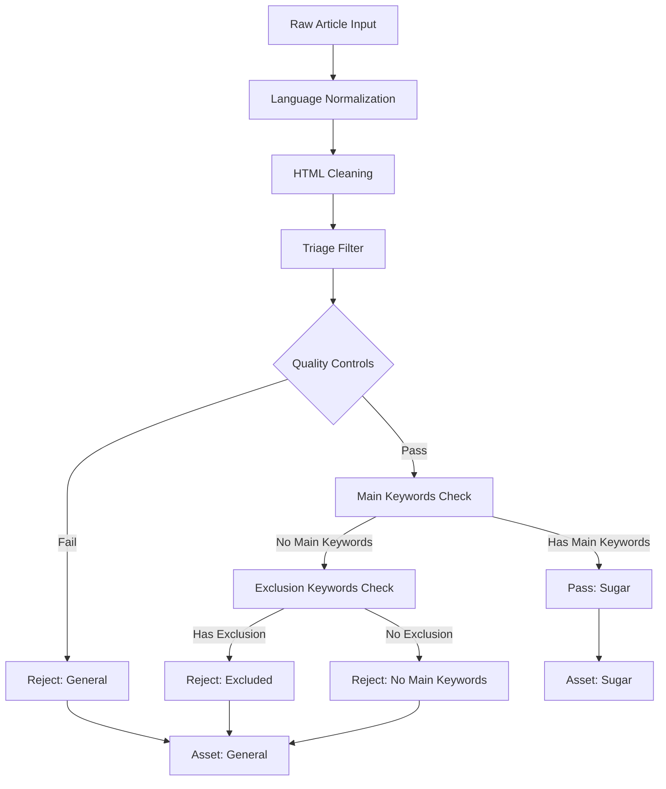

# Sugar News Filtering Logic Fix Plan

## Current Issues Identified

### Issue 1: AND Logic in Secondary Filter (Too Restrictive)
**Location**: `sugar_triage_filter.py` lines 167-183

**Current Logic**:
```python
# BOTH conditions must be true (AND logic) - TOO RESTRICTIVE
event_match = text_matches_keywords(text, KEYWORD_PATTERNS["event"])
agri_match = (
    text_matches_keywords(text, KEYWORD_PATTERNS["market"]) or
    text_matches_keywords(text, KEYWORD_PATTERNS["supply_chain"])
)
if event_match and agri_match:  # AND logic requires BOTH
    result["reason"] = "Passed secondary filter: event+agriculture context"
    result["passed"] = True
    return result
```

**Problem**: Articles need BOTH event keywords AND agriculture keywords to pass. This rejects valid articles like:
- "Sugar prices reach 5-year high on strong demand" (has agriculture but no event)
- "Brazil sugar harvest affected by drought" (has event but no market keywords)

### Issue 2: Overly Strict Context Zone Requirement
**Location**: `sugar_triage_filter.py` lines 185-207

**Current Logic**:
```python
# Must have at least one context zone - TOO RESTRICTIVE
if not matched_zones:
    result["reason"] = "No context zone keywords found"
    return result
```

**Problem**: Articles with main sugar keywords but no context zone keywords are rejected. This rejects valid articles like:
- "Sugar production increases in Brazil" (has main keyword but no specific context zone)
- "New sugar factory opens in Thailand" (has main keyword but no specific context zone)

## Proposed Fix: Simplified, More Inclusive Filtering

### Updated Filtering Logic Flow



### Key Changes:

#### 1. Remove Secondary Filter AND Logic
Instead of requiring both event AND agriculture keywords, we'll simplify the logic:

**Current** (lines 167-183):
```python
# Remove this entire secondary filter check
event_match = text_matches_keywords(text, KEYWORD_PATTERNS["event"])
agri_match = (
    text_matches_keywords(text, KEYWORD_PATTERNS["market"]) or
    text_matches_keywords(text, KEYWORD_PATTERNS["supply_chain"])
)
if event_match and agri_match:
    result["reason"] = "Passed secondary filter: event+agriculture context"
    result["passed"] = True
    result["matched_zones"] = []
    result["matched_keywords"] = []
    result["extracted_sugar_pricing"] = []
    return result
```

**Fixed**: Remove this entire section and proceed directly to context zones check.

#### 2. Make Context Zones Optional
Instead of requiring context zones, we'll make them optional but still track them:

**Current** (lines 185-207):
```python
if not matched_zones:
    result["reason"] = "No context zone keywords found"
    return result
```

**Fixed**:
```python
# Context zones are now optional, not required
# Continue processing even if no context zones found
```

#### 3. Updated Triage Filter Logic

The simplified logic will be:
1. **Quality Controls** (AND logic - keep as is)
2. **Main Keywords Check** (OR logic - keep as is)
3. **Exclusion Keywords Check** (OR logic - keep as is)
4. **Context Zones Check** (Optional - track but don't require)
5. **Structured Pricing Extraction** (Keep as is)
6. **Pass** (If main keywords found and no exclusion keywords)

### Implementation Details

#### File to Modify: `sugar_triage_filter.py`

**Section 1: Remove Secondary Filter (lines 167-183)**
```python
# REMOVE this entire section:
# If main keywords found, check for secondary filter (event+agriculture)
event_match = text_matches_keywords(text, KEYWORD_PATTERNS["event"])
agri_match = (
    text_matches_keywords(text, KEYWORD_PATTERNS["market"]) or
    text_matches_keywords(text, KEYWORD_PATTERNS["supply_chain"])
)
if event_match and agri_match:
    result["reason"] = "Passed secondary filter: event+agriculture context"
    if not any("sugar_news_fetcher" in arg for arg in sys.argv):
        logger.debug("PASS: %s | TEXT: %r", result["reason"], normalized_text)
    else:
        logger.debug("PASS: %s", result["reason"])
    result["passed"] = True
    result["matched_zones"] = []
    result["matched_keywords"] = []
    result["extracted_sugar_pricing"] = []
    return result
```

**Section 2: Make Context Zones Optional (lines 201-207)**
```python
# CHANGE from:
if not matched_zones:
    result["reason"] = "No context zone keywords found"
    if not any("sugar_news_fetcher" in arg for arg in sys.argv):
        logger.debug("REJECT: %s | TEXT: %r", result["reason"], normalized_text)
    else:
        logger.debug("REJECT: %s", result["reason"])
    return result

# TO:
# Context zones are now optional - continue processing even if none found
if not matched_zones:
    logger.debug("No context zone keywords found - continuing processing")
```

### Expected Impact

#### Before Fix:
- Articles need main keywords + (event AND agriculture) + context zones
- Many valid sugar articles rejected
- Low recall, potentially high precision

#### After Fix:
- Articles need only main keywords (and no exclusion keywords)
- More valid sugar articles captured
- Higher recall, maintained precision

### Example Scenarios

#### Example 1: Market Price Article
```
Text: "Sugar prices reach 5-year high on strong demand from China"
- Main keywords: "sugar" ✓
- Exclusion keywords: None ✓
- Context zones: "market" ✓ (but now optional)
Result: PASS ✓
```

#### Example 2: Simple Production Article
```
Text: "Brazil increases sugar production for export markets"
- Main keywords: "sugar" ✓
- Exclusion keywords: None ✓
- Context zones: None (but now optional)
Result: PASS ✓
```

#### Example 3: Mixed Commodity Article
```
Text: "Sugar and oil prices fluctuate on market uncertainty"
- Main keywords: "sugar" ✓
- Exclusion keywords: "oil" ✗
Result: REJECT (correctly excluded) ✓
```

### Testing Plan

1. **Unit Tests**: Test individual filtering components
2. **Integration Tests**: Test end-to-end filtering with sample articles
3. **Performance Metrics**: Measure precision/recall before and after fix
4. **Manual Review**: Validate that borderline cases are handled correctly

### Risk Assessment

**Low Risk**:
- Removing overly restrictive filters
- Making context zones optional (still tracked for analysis)

**Mitigations**:
- Keep exclusion keyword filtering to maintain precision
- Still track context zones for analysis even if not required
- Monitor performance metrics after deployment

## Conclusion

The proposed fix simplifies the filtering logic by removing unnecessary AND conditions and making context zones optional. This will improve recall while maintaining precision, resulting in more comprehensive sugar news coverage without sacrificing quality.