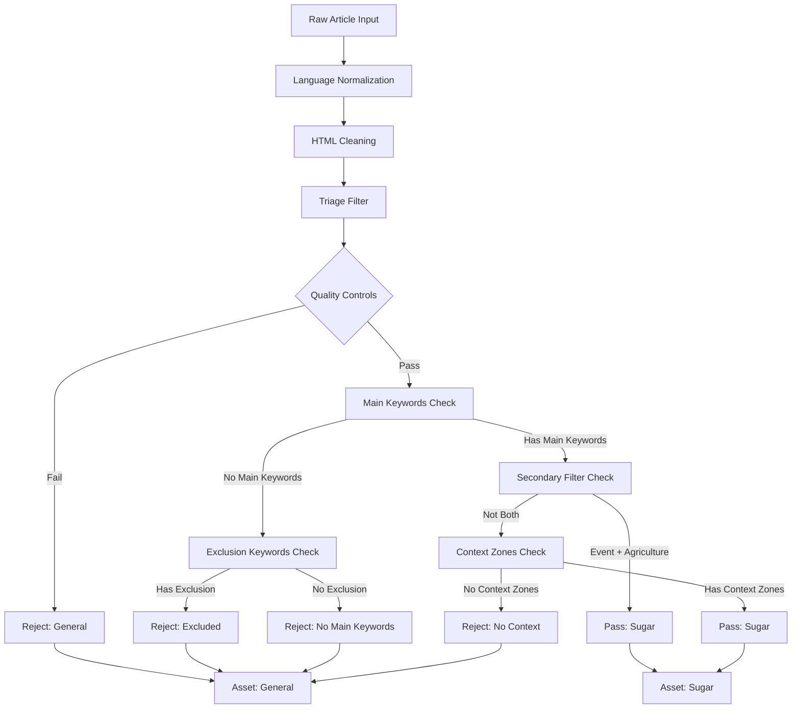

# Sugar News Filtering Logic Analysis

## Current Filtering Flow Diagram



## Detailed Filtering Logic Breakdown

### 1. Quality Controls (AND Logic)
```python
# ALL conditions must be true (AND logic)
if not media_topic_passed:  # FAIL
if not isinstance(text, str) or not text.strip():  # FAIL
if len(text) < min_length:  # FAIL
if max_length is not None and len(text) > max_length:  # FAIL
```

### 2. Main Keywords Check (OR Logic)
```python
# AT LEAST ONE main keyword must match (OR logic)
main_match = text_matches_keywords(text, KEYWORD_PATTERNS["main"])
```

### 3. Exclusion Keywords Check (OR Logic)
```python
# IF no main keywords, check for ANY exclusion keyword (OR logic)
if not main_match:
    for pat in EXCLUSION_PATTERNS:
        if pat.search(text):  # ANY match causes rejection
            result["reason"] = f"Excluded by exclusion keyword: '{pat.pattern}'"
            return result
```

### 4. Secondary Filter Check (AND Logic) ⚠️ **PROBLEM AREA**
```python
# BOTH conditions must be true (AND logic) - THIS IS THE ISSUE
event_match = text_matches_keywords(text, KEYWORD_PATTERNS["event"])
agri_match = (
    text_matches_keywords(text, KEYWORD_PATTERNS["market"]) or
    text_matches_keywords(text, KEYWORD_PATTERNS["supply_chain"])
)
if event_match and agri_match:  # AND logic requires BOTH
    result["reason"] = "Passed secondary filter: event+agriculture context"
    result["passed"] = True
    return result
```

### 5. Context Zones Check (OR Logic)
```python
# AT LEAST ONE zone must match (OR logic)
for zone in ["market", "supply_chain", "event", "region"]:
    zone_patterns = KEYWORD_PATTERNS[zone]
    for pat, kw in zip(zone_patterns, KEYWORDS[zone]):
        if pat.search(text):  # ANY match in the zone
            matched_zones.append(zone)
            matched_keywords.append(kw)
            break  # Only need one match per zone

if not matched_zones:  # FAIL if no zones matched
    result["reason"] = "No context zone keywords found"
    return result
```

## The Problem: AND vs OR Logic

### Current Issue in Secondary Filter
The secondary filter uses **AND logic** which requires BOTH:
1. Event keywords (weather, drought, frost, etc.)
2. Agriculture keywords (market OR supply_chain)

This is too restrictive! An article about sugar market prices should pass even if there's no weather event.

### Example of the Problem:
```
Article: "Sugar prices reach 5-year high on strong demand from China"
- Has main keyword: "sugar" ✓
- Has agriculture keyword: "market" ✓
- Has NO event keyword: "weather/drought" ✗
- Result: FAILS secondary filter ❌
```

This article should pass because it's clearly about sugar markets, but it fails because it lacks weather/event keywords.

## Recommended Fix: Change AND to OR Logic

### Proposed Secondary Filter Logic:
```python
# Change from AND to OR logic
event_match = text_matches_keywords(text, KEYWORD_PATTERNS["event"])
agri_match = (
    text_matches_keywords(text, KEYWORD_PATTERNS["market"]) or
    text_matches_keywords(text, KEYWORD_PATTERNS["supply_chain"])
)
if event_match or agri_match:  # OR logic - EITHER is sufficient
    result["reason"] = "Passed secondary filter: event OR agriculture context"
    result["passed"] = True
    return result
```

### Updated Filtering Flow with Fix:


## Impact of the Fix

### Before Fix (AND Logic):
- Articles need BOTH event AND agriculture context
- Many valid sugar market articles are rejected
- Lower recall for relevant articles

### After Fix (OR Logic):
- Articles need EITHER event OR agriculture context
- More valid sugar articles are captured
- Better recall while maintaining precision

## Keyword Categories

### Main Keywords (Sugar-related):
- sugar, sugarcane, sugar beet, whites, NY11, LSU, LON No. 5
- Multilingual variants (sucre, azúcar, zucchero, etc.)

### Event Keywords (Weather/Climate):
- weather, drought, frost, rain, monsoon, climate
- El Niño, La Niña, storm, flood, heatwave

### Agriculture Keywords (Market/Supply):
- Market: futures, contract, price, market, export, import
- Supply Chain: harvest, crushing, yield, production, output

### Region Keywords (Geographic):
- Brazil, India, Thailand, EU, USDA, etc.

## Conclusion

The current filtering logic is too restrictive due to the AND logic in the secondary filter. Changing it to OR logic will capture more relevant sugar articles while maintaining the integrity of the filtering system. This fix will improve the recall of the sugar news fetcher without significantly impacting precision.