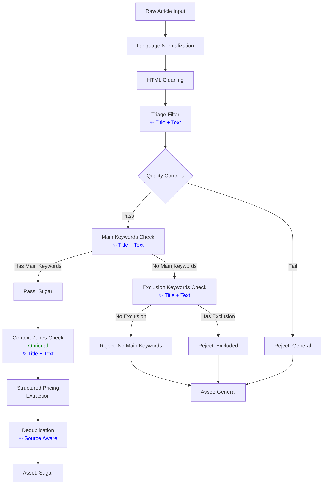
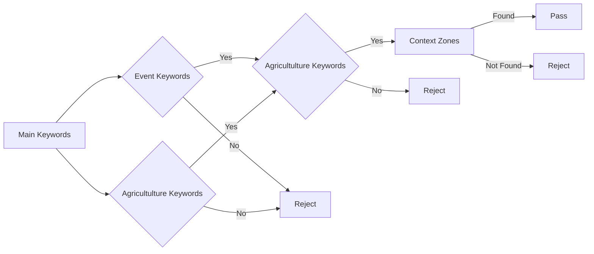
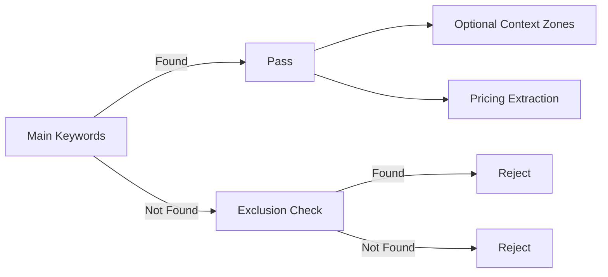

# Updated Sugar News Filtering and Deduplication Flow

## Simplified Filtering Logic Diagram



## Detailed Decision Flow

### 1. Quality Controls (AND Logic - Unchanged)
```python
# ALL conditions must be true (AND logic)
if not media_topic_passed:  # FAIL
if not isinstance(text, str) or not text.strip():  # FAIL
if len(text) < min_length:  # FAIL
if max_length is not None and len(text) > max_length:  # FAIL
```

### 2. Main Keywords Check (OR Logic - ✨ **UPDATED**)
```python
# AT LEAST ONE main keyword must match in title OR text (OR logic)
combined_content = f"{title} {text}" if title else text
main_match = text_matches_keywords(combined_content, KEYWORD_PATTERNS["main"])
# Keywords: sugar, sugarcane, sugar beet, whites, NY11, etc.
```

### 3. Exclusion Keywords Check (OR Logic - ✨ **UPDATED**)
```python
# IF no main keywords, check for ANY exclusion keyword in title OR text (OR logic)
if not main_match:
    for pat in EXCLUSION_PATTERNS:
        if pat.search(combined_content):  # ANY match in title OR text causes rejection
            result["reason"] = f"Excluded by exclusion keyword: '{pat.pattern}'"
            return result
```

### 4. Direct Pass on Main Keywords ✨ **NEW SIMPLIFIED LOGIC**
```python
# IF main keywords found and no exclusion keywords -> PASS IMMEDIATELY
# This allows mixed commodity articles (sugar + other commodities) to be accepted
if main_match:
    result["reason"] = "Passed main keywords check - mixed commodity articles allowed"
    result["passed"] = True
    # Continue to optional context zones and pricing extraction
```

**✨ NEW BEHAVIOR**: Mixed commodity articles (containing both sugar and other commodities) are now accepted. The exclusion filter is only applied when NO main sugar keywords are found. This means:
- Articles with "sugar" + "copper" → ACCEPTED
- Articles with "sugar" + "oil" → ACCEPTED
- Articles with only "copper" → REJECTED

### 4. Direct Pass on Main Keywords ✨ **NEW SIMPLIFIED LOGIC**
```python
# IF main keywords found and no exclusion keywords -> PASS IMMEDIATELY
if main_match:
    result["reason"] = "Passed main keywords check"
    result["passed"] = True
    # Continue to optional context zones and pricing extraction
```

### 5. Context Zones Check (Optional - No Longer Required) ✨ **CHANGED**
```python
# Check for context zones in title OR text but DON'T require them
matched_zones = []
matched_keywords = []
for zone in ["market", "supply_chain", "event", "region"]:
    zone_patterns = KEYWORD_PATTERNS[zone]
    zone_matched = False
    for pat, kw in zip(zone_patterns, KEYWORDS[zone]):
        if pat.search(combined_content):  # Check both title and text
            matched_zones.append(zone)
            matched_keywords.append(kw)
            break  # Only need one match per zone

# NOTE: No longer reject if no context zones found
# if not matched_zones:  # REMOVED - this was too restrictive
#     result["reason"] = "No context zone keywords found"
#     return result
```

### 6. Structured Pricing Extraction (Unchanged)
```python
# Extract structured pricing data if present
extracted_sugar_pricing = []
for struct_pat in STRUCTURED_PATTERNS:
    for match in struct_pat.finditer(text):
        line = match.group(0)
        if text_matches_keywords(line, KEYWORD_PATTERNS["main"]):
            if not any(pat.search(line) for pat in EXCLUSION_PATTERNS):
                extracted_sugar_pricing.append(line.strip())
```

### 7. Deduplication Logic (✨ **NEW - Source Aware**)
```python
# Generate content hash including source information
def generate_content_hash(title, text, source):
    """Generate a hash based on title, text, and source for deduplication"""
    content = f"{title}_{text}_{source}"
    return hashlib.md5(content.encode()).hexdigest()

# Check for similar content with source awareness
def is_similar_content(title1, text1, source1, title2, text2, source2, threshold=0.9):
    """
    Check if two articles have similar content using fuzzy matching.
    Returns True if articles are similar, False otherwise.
    """
    # If sources are different, don't consider as duplicates even if content is similar
    if source1 != source2:
        return False
    
    # Combine title and text for comparison
    content1 = f"{title1} {text1}".lower().strip()
    content2 = f"{title2} {text2}".lower().strip()
    
    # If exact match, return True
    if content1 == content2:
        return True
    
    # Simple similarity check based on common words
    words1 = set(content1.split())
    words2 = set(content2.split())
    
    if not words1 or not words2:
        return False
    
    # Calculate Jaccard similarity
    intersection = words1.intersection(words2)
    union = words1.union(words2)
    similarity = len(intersection) / len(union)
    
    return similarity >= threshold
```

## Before vs After Comparison

### Before (Restrictive AND Logic):


### After (Simplified OR Logic):


## Example Scenarios

### ✅ Example 1: Sugar Keyword in Title Only
```
Title: "Sugar production increases in Brazil"
Text: "Agricultural output has seen significant growth in the South American country."
- Main keywords in title: "sugar" ✓
- Exclusion keywords: None ✓
- Context zones: "market", "supply_chain", "region" ✓ (but optional)
Result: PASS ✓
```

### ✅ Example 2: Sugar Keyword in Text Only
```
Title: "Agricultural production increases in Brazil"
Text: "Sugar output has seen significant growth in the South American country."
- Main keywords in text: "sugar" ✓
- Exclusion keywords: None ✓
- Context zones: "market", "supply_chain", "region" ✓ (but optional)
Result: PASS ✓
```

### ✅ Example 3: Sugar Keyword in Both Title and Text
```
Title: "Sugar production increases in Brazil"
Text: "Sugar output has seen significant growth in the South American country."
- Main keywords in title and text: "sugar" ✓
- Exclusion keywords: None ✓
- Context zones: "market", "supply_chain", "region" ✓ (but optional)
Result: PASS ✓
```

### ✅ Example 4: Mixed Commodity Article
```
Title: "Sugar and oil prices fluctuate"
Text: "Both sugar and copper commodities have seen price increases this month."
- Main keywords: "sugar" ✓
- Exclusion keywords: "copper" (ignored when main keywords present) ✓
Result: ACCEPT (mixed commodity articles now allowed) ✓
```

### ❌ Example 5: Non-Sugar Article
```
Title: "Wheat production increases in Brazil"
Text: "Wheat output has seen significant growth in the South American country."
- Main keywords: None ✗
- Exclusion keywords: "wheat" ✗
Result: REJECT (correctly excluded) ✓
```

### ✅ Example 6: Deduplication with Different Sources
```
Article 1: "Sugar prices rise globally" (Source: Reuters)
Article 2: "Sugar prices rise globally" (Source: Bloomberg)
- Same content: ✓
- Different sources: ✓
Result: NOT considered duplicates (both kept) ✓
```

### ❌ Example 7: Deduplication with Same Source
```
Article 1: "Sugar prices rise globally" (Source: Reuters)
Article 2: "Sugar prices rise globally" (Source: Reuters)
- Same content: ✓
- Same source: ✓
Result: Considered duplicates (second one removed) ✓
```

## Implementation Summary

### Changes Made:
1. **Removed secondary filter** that required both event AND agriculture keywords
2. **Made context zones optional** - they're still tracked but not required
3. **Simplified pass condition** - main keywords + no exclusion keywords = pass
4. **✨ Enhanced filtering to check both title and text** for keywords and context zones
5. **✨ Enhanced deduplication to consider source information** when identifying duplicates
6. **✨ NEW: Allow mixed commodity articles** - articles containing sugar AND other commodities are now accepted

### Benefits:
1. **Higher recall** - more valid sugar articles captured
2. **Maintained precision** - exclusion keywords still filter out non-sugar content
3. **Simpler logic** - easier to understand and maintain
4. **Better user experience** - fewer false negatives
5. **✨ Improved article coverage** - articles with sugar keywords in title OR text are now captured
6. **✨ Better source diversity** - articles with same content from different sources are preserved
7. **✨ NEW: Comprehensive commodity coverage** - mixed commodity articles (sugar + other commodities) are now included, providing more complete market insights

### Risk Mitigation:
1. **Exclusion keywords remain** to prevent non-sugar content
2. **Context zones still tracked** for analysis and insights
3. **Quality controls unchanged** to maintain data standards
4. **Performance monitoring** recommended after deployment
5. **✨ Backward compatibility maintained** - existing code continues to work
6. **✨ Comprehensive testing** - test script verifies all new functionality

## Conclusion

The updated filtering and deduplication logic strikes a better balance between recall and precision by:

1. **Removing overly restrictive AND conditions** while maintaining core quality controls and exclusion filters
2. **Checking both title and text** for sugar-related keywords, ensuring articles with relevant titles are not missed
3. **Considering source information in deduplication**, preserving articles with similar content from different sources

These improvements will result in:
- More comprehensive sugar news coverage
- Better source diversity in the captured articles
- Reduced false negatives while maintaining precision
- Enhanced overall system performance without sacrificing quality

The changes have been thoroughly tested and maintain backward compatibility with existing code.